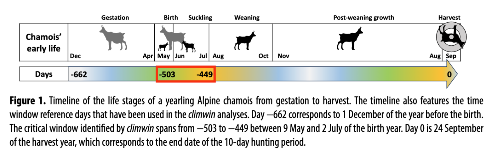
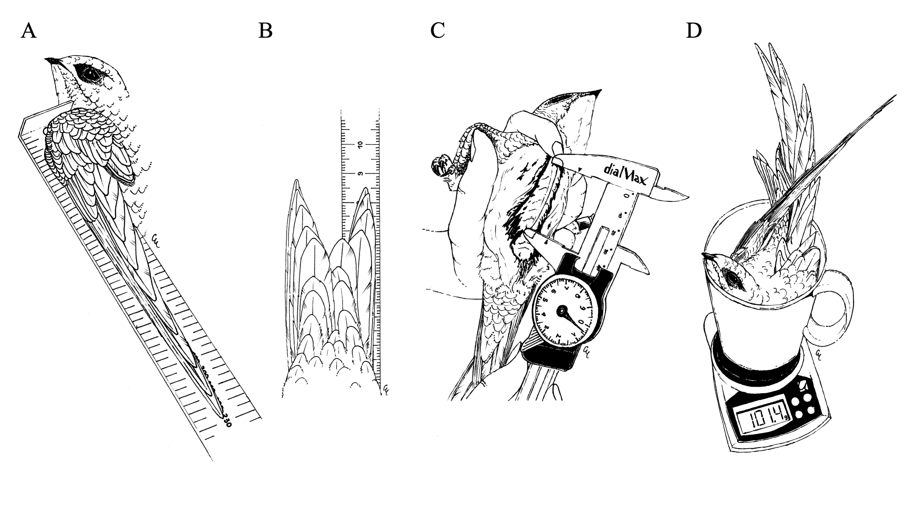
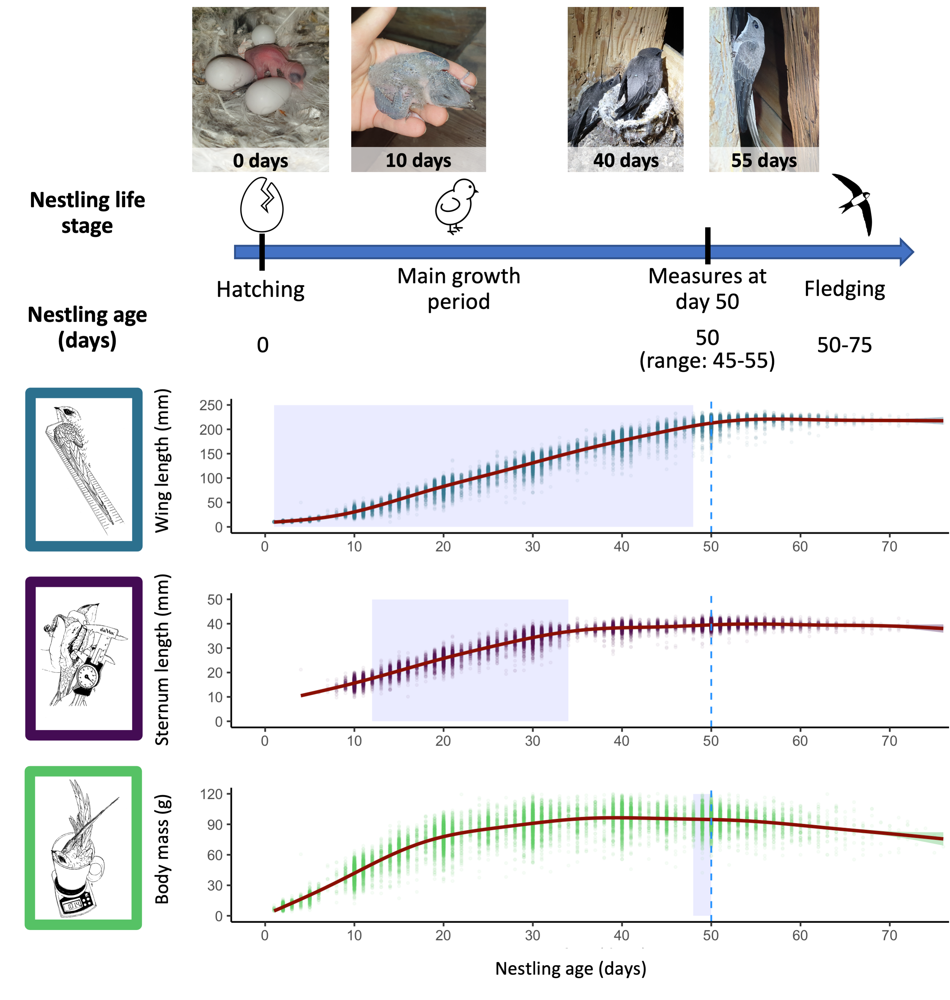
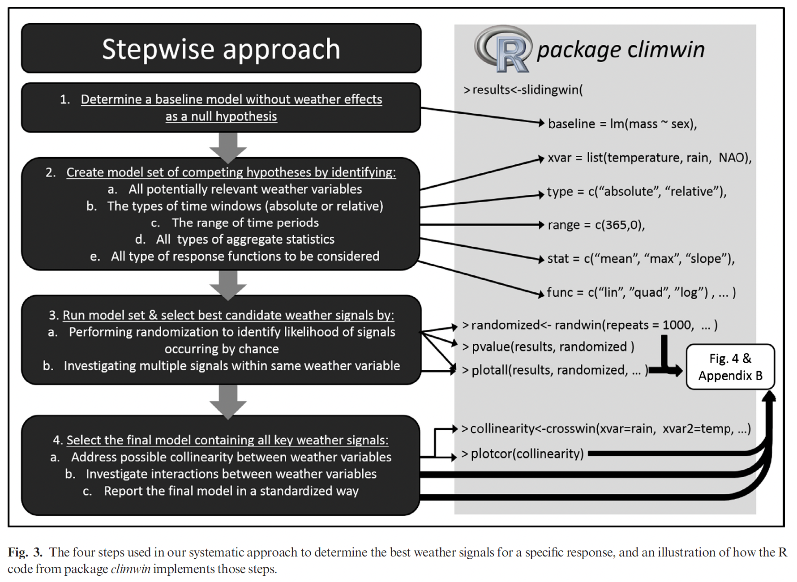
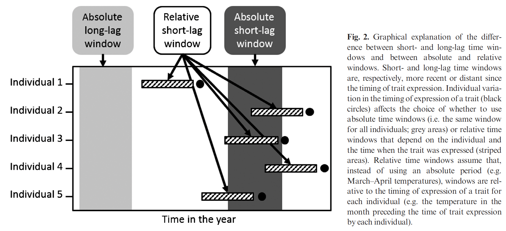
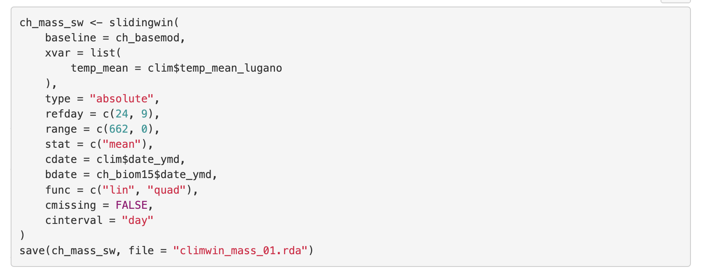

# The climwin approach

From the R help file for the package, you can see if by typing ??climwin in the console.

climwin is a package in R to help users detect a time period or ‘window’ over which a response variable (usually biological) is sensitive to the environment (usually climate/weather). Periods of climate sensitivity can help inform experimental design, improve species modelling or allow users to more effectively account for climate in statistical modelling. This vignette will give an introduction to the package and its basic features. The advanced vignette provides more detail on the ‘advanced’ features present within the package.

__Why do we need climwin?__

The characteristics of an organism are likely to change within a year (e.g. body condition, behaviour), and these will influence the way in which an organism responds to its environment at different points in time. Therefore, when we are interested in studying the effects of climate on some biological response the time period or ‘window’ over which we choose to collect climate data can strongly influence the outcome and interpretation of our results. Yet there has been a tendency in ecological research to focus on a limited number of windows, often chosen arbitrarily. For example, there has been a strong focus on the biological impacts of average spring conditions.

Without a critical comparison of different possible windows, we limit our ability to make meaningful conclusions from our research. If a biological trait displays no response to an arbitrarily chosen climate window it is difficult to determine if this is evidence of insensitivity to climate or whether the choice of time period is flawed. Even when we find a relationship between climate and the biological response, we cannot be sure that we have selected the period where the trait is most sensitive. Therefore, there is a need for a more effective method through which we can select our sampling period.

Realistically, manually testing and comparing all possible windows can be difficult and time consuming. With climwin we hope to overcome this problem by employing exploratory approaches to test and compare the effects of all possible climate windows. This will remove the need to arbitrarily select climate windows, and will consequently improve our research outcomes and conclusions. Below we will outline the basic features of the climwin package, including how to carry out and interpret a climate window analysis.




# Libraries and datasets

## Libraries

```{r, eval = FALSE}
# install the missing packages
install.packages("dplyr")
install.packages("lubridate")
install.packages("climwin")
```

```{r setup, message = FALSE}
# data manipulation
library(dplyr)
library(lubridate)
# models
library(lme4)
library(lmerTest)
library(climwin)
# graphics
library(ggplot2)

knitr::opts_chunk$set(
  fig.path = "Figures/"
)
```


## The datasets

```{r message = FALSE}
# loading the datasets
data_nestlings <- read.csv("Data/data_nestlings.csv",
  stringsAsFactors = TRUE, na = c("", "NA")
)
data_weather <- read.csv("Data/data_clim.csv",
  stringsAsFactors = TRUE, na = c("", "NA")
)
```

## Nestling data


_Study system_

Data were collected between 1999 and 2023 in a Swiss population of Alpine swift. It is a long-distance migratory bird that breeds in colonies of a few to several hundred pairs in holes within cliffs or under the roofs of tall buildings. In Switzerland, Alpine swifts return to their breeding grounds from sub-Saharan Africa at the beginning of April (Meier et al. 2020) and start laying eggs between early May and June, with significant adaptive variations in laying dates depending on weather conditions (de Villemereuil et al. 2020). Females lay one clutch a year, with one to four eggs per clutch (modal clutch size is three). Both parents incubate the eggs for about 18 days and then feed their nestlings until fledging, which occurs around 55 days after hatching (range 50-76 days; (Bize et al. 2004) and this manuscript). After breeding, Alpine swifts migrate back to Africa in September (Meier et al. 2020).

Fieldwork was carried out in two Alpine swift colonies located in clock towers in the Swiss cities of Biel (60-100 breeding pairs) and Solothurn (40-55 breeding pairs), ca. 20km apart. Each year, both colonies were regularly visited to monitor egg laying and clutch size, to capture and measure adults, and to ring and measure nestlings. Nestlings were individually recognised by ringing them with numbered metal rings 10 to 15 days after hatching. Nestlings were measured regularly (usually every 5 to 10 days, on average five times in total) until fledging. At each measurement, we measured wing length with a ruler to the nearest 1 mm, sternum size with a calliper to the nearest 0.1 mm, and body mass with a digital scale to the nearest 0.1 g. The measure of sternum length provides an estimate of skeletal growth and size. Tarsus length has been commonly used in passerines, but it is difficult to measure in a repeatable way in a species with short and bulky tarsi, such as swifts. As nestlings are not ringed at hatching, the age of the nestlings in a brood is based on the hatching date of the first nestling; the last nestling is usually born on the same day or 1 day later. Therefore, measurements for a brood of three nestlings, for example, are taken when the first-hatched nestling reaches 50 days of age, the youngest one might be the same age or 1 day younger. Only nestlings that survived up to fledging were included in the statistical analyses. Sample sizes differ between traits, as wing length and body mass have been measured since 1999, while sternum length has been measured since 2003. 

The figure below shows how the measures are collected. 

A - Wing length is measured using a ruler specific for bird ringing with a bended part on one side to avoid movements of the wing. Data is recorded to the closest millimeter. 

B - Tail length is measured using a thin ruler positioned between the two outermost tail feathers. Data is recorded to the closest millimeter. Both sides are measured and the average is used for the analyses.

C - Sternum length is measured using a calliper. Breast feathers are kept open using cotton and ethanol. Calliper is positioned just above the belly on the lowest part of the sternum bone and then closed on the highest part of the sternum bone, close to the head. Data is recorded to the closest tenth of a millimeter.

D - Body mass is measured using a kitchen scale. Data is recorded to the closest tenth of a gram. 







```{r}
str(data_nestlings)
summary(data_nestlings)
```


## Weather data
```{r}
str(data_weather)
summary(data_weather)
```

To estimate the weather conditions during nestling development, we used meteorological data collected from five Swiss meteorological stations surrounding Biel and Solothurn (Bern-Zollikofen, Cressier, Grenchen, Koppigen, Wynau). Doing so allowed us to cover the whole foraging area of the swifts (up to 30 km in a single foraging trip) (Arn-Willi 1960) and to account for microenvironmental variations (i.e., strong weather events captured by one station only). Daily weather data were averaged across the five stations to obtain two variables: mean daily temperature (average air temperature at 2 m above ground for the whole day), daily precipitation (total rainfall for that day) and wind speed (daily mean of the wind speed scalar in m/s.).


[Base map] (https://commons.wikimedia.org/wiki/File:Switzerland_relief_location_map.jpg) credits to Eric Gaba [Wikimedia Commons user: Sting] (https://commons.wikimedia.org/wiki/User:Sting) and Wikimedia [Commons user: NordNordWest] (https://commons.wikimedia.org/wiki/User:NordNordWest). This file is licensed under the Creative Commons Attribution-Share Alike 3.0 Unported license.


## Preparing the variables
```{r}
# year of measurement as factor
data_nestlings$year_f <- as.factor(data_nestlings$year)
data_nestlings$ring <- as.factor(data_nestlings$ring)

# Date variables as dates
data_nestlings$date_hatch <- as.Date(data_nestlings$date_hatch, "%d/%m/%y")
data_weather$date <- as.Date(data_weather$date, "%d/%m/%y")

# The nestlings are measured at 50 days, this date is necessary for climwin
data_nestlings$date_50days <- data_nestlings$date_hatch + 50

# Hatching date as day of the year, to get the seasonal effect
data_nestlings$hatch_doy <- yday(data_nestlings$date_hatch)

# scaling variables for the analyses
data_nestlings$hatch_doy_sc <- scale(data_nestlings$hatch_doy)[, 1]
```


# Climwin analyses

 

The overall approach for the climwin analysis is to compare the support by the data for competing hypotheses and to formalize them into regression models (van de Pol et al., 2016). 

Competing models are based upon a baseline model (called also null model, a model without weather effects) and ranked using the deltaAICc, or the difference in terms of the Akaike Information Criterion values calculated for a small sample size between the candidate model and baseline model. 

Climwin presents the models using the deltaAICc value relative to the baseline model (AICc of the candidate model - AICc of the baseline model). Therefore, a model that is more supported than the baseline model will have a negative deltaAICc value. On the same hand the model with the best support from the data, usually with lowest AICc, will be shown as the model with lowest deltaAICc in the climwin output. 

The baseline model was a linear mixed model with the wing length of the nestlings at 50 days of age in relation to brood size, colony of hatching, hatching day, and exact age of measurement (range 45-55 days of age). The function slidingwin creates a candidate set of competing models testing windows of different lengths for the weather variable of interest, in this study the mean daily ambient temperature (°C).  

For the analyses we used an individual specific time window, based on the date when the nestlings had 50 days. We then looked for windows between this reference date and 50 days before.

Non-linear effects of temperature on the traits were taken into account by checking for both linear and quadratic trends. This is mentioned in the climwin output as func = lin (only linear term) func = quad (linear and quadratic terms).


## Base model

According to (van de Pol et al. 2016), we built a base model that includes variables that can affect the traits. As random effects, we included brood ID and year as a factor to account for non-independence among nestlings belonging to the same brood and nestlings hatched in the same year. 

Creating the subsets needed for the analyses
```{r}
data_nestlings_wing_50 <- subset(data_nestlings, !is.na(wing_50))
```

Baseline model
```{r baseline models}
wing_50_basemod <- lme4::lmer(
  wing_50 ~
    brood_size + hatch_doy_sc +
    (1 | year_f) + (1 | nestcode_rearing),
  control = lmerControl(optimizer = "bobyqa", optCtrl = list(maxfun = 1e+06)),
  data = data_nestlings_wing_50
)
```

## Finding the best window

Summary of climwin



Using the function slidingwin allows to search for the best climatic window:

```{r slidingwin, eval = FALSE}
?slidingwin # check the function

wing_50_sw1 <- slidingwin(
  baseline = wing_50_basemod,
  xvar = list(
    temp_mean = data_weather$t_daily_mean
  ),
  stat = c("mean"),
  func = c("lin", "quad"),
  type = "relative", # the window is relative to the individual
  range = c(50, 0),
  # 0 is the date given in bdate, 50 is the number of days before that date
  cinterval = "day",
  cdate = data_weather$date,
  bdate = data_nestlings_wing_50$date_50days
)

wing_50_sw2 <- slidingwin(
  baseline = wing_50_basemod,
  xvar = list(
    rain_sum = data_weather$rain_daily
  ),
  stat = c("sum"),
  func = c("lin", "quad"),
  type = "relative",
  # the window is relative to the individual
  range = c(50, 0),
  # 0 is the date given in bdate, 50 is the number of days before that date
  cinterval = "day",
  cdate = data_weather$date,
  bdate = data_nestlings_wing_50$date_50days
)
wing_50_sw <- merge_results(wing_50_sw1, wing_50_sw2)
save(wing_50_sw, file = "Output/wing_50_sw.rda")
```

What does it mean to have a climatic window relative to the individual or absolute?






## Investigating the models
Loading the models
```{r}
load(file = "Output/wing_50_sw.rda")
```

Best windows for linear and linear+quadratic models for temperature and rainfall sorted by deltaAICc such that the best supported model is on top. 

```{r}
wing_50_sw$combos[order(wing_50_sw$combos$DeltaAICc), ]
```

The linear term better explains the variation in the data (deltaAICc has the lowest value)

The analyses are stored in a list and the row number here corresponds to the number of the set of models in the list. e.g. [1] = linear models for the temperature, [2] = quadratic models for the temperature, etc...

It's the number you will need to investigate the models in the functions below.


### The best linear models for temperature

Ten of the best windows for the linear models sorted by deltaAICc. To investigate any other tested hypothesis we can simply replace the number on the left or in the double square brackets with the corresponding list number.

```{r}
# wing_50_sw is a list of sets of models
# best set of models for the temperature is the linear models, number 1
# if I would want to investigate the linear models for rainfall
# I would need wing_50_sw[[3]]
head(wing_50_sw[[1]]$Dataset, 10)
```


All models with the lowest AICc present very comparable windows.

```{r}
# Saving the best windows (deltaAICc difference from the best model < 3)
# for the linear models sorted by deltaAICc.

wing_50_bestmod <- subset(
  wing_50_sw[[1]]$Dataset,
  deltaAICc < wing_50_sw[[1]]$Dataset$ModWeight[1] + 3
)
```

### Windows plot

It's possible to extract the time windows of all the best supported models (i.e. multi-model inference). This panel shows the opening and closing points of the time windows that were best supported by the data, here those models that made up 95% model confidence set. 
```{r plotwin}
plotwin(wing_50_sw[[1]]$Dataset)
```


### Delta plot
The variation in deltaAICc between time windows can be better investigated using the following plot:

```{r plotdelta}
plotdelta(
  dataset =
    wing_50_sw[[1]]$Dataset, arrow = TRUE
)
```

Warmer areas shows values with the lowest deltaAICc (i.e. "best models"). As explained by van de Pol et al., 2016, these deltaAICc landscapes of the different time windows shows multiple peaks (red areas) instead of a clear single peak. This can indicate the presence of multiple (e.g. possibly both long- and short-lag) weather signals within the same weather variable, but it can also occur due to collinearity or chance. 

The evidence for multiple signals can be therefore investigated by adding the best supported of the weather windows to the baseline model, and re-fitting all the different time windows again: this tests whether there is still strong model support for the second best (e.g. short-lag) weather window once the other best supported (e.g. long-lag) weather window has been accounted for in the baseline model (here in the Step 2).


### Beta plot
This panel shows the model support (deltaAICc) for all fitted time windows tried, shown for each combination of Window open (y-axis) and Window close (x-axis). Models with the lowest deltaAICc (red) are the best supported (colours show the deltaAICc levels compared to the null model, see legend). Strongly supported windows will often be grouped together. 
```{r plotbetas}
plotbetas(wing_50_sw[[1]]$Dataset, arrow = TRUE)
```


### Autocollinearity

Correlation between the mean temperature during the best supported time window and the mean temperature over all other time windows.

```{r, eval = FALSE}
autocoll <- autowin(
  reference = wing_50_sw[[1]],
  baseline = wing_50_basemod,
  xvar = list(temp_mean = data_weather$t_daily_mean),
  type = "relative",
  range = c(50, 0),
  stat = "mean",
  cdate = data_weather$date,
  bdate = data_nestlings_wing_50$date_50days,
  func = "quad",
  # cmissing = FALSE,
  cinterval = "day"
)

save(autocoll, file = "Output/wing_50_autocall.rda")
```

```{r plotcorr}
load(file = "Output/wing_50_autocall.rda")
plotcor(autocoll, type = "A", arrow = TRUE)
```


### Randwin

Using randwin() to randomize the identity of the nestling, we are able to check if the window that was found before is actually important, or the relationship was just random.

```{r, eval = FALSE}
# Performing randamization to identify
# likelyhood of signals occurring by chance

wing_50_rand100 <- randwin(
  repeats = 100,
  baseline = wing_50_basemod,
  xvar = list(temp_mean = data_weather$t_daily_mean),
  stat = c("mean"),
  func = c("lin"),
  type = "relative", # relative to the individual
  range = c(50, 0),
  cinterval = "day",
  cdate = data_weather$date,
  bdate = data_nestlings_wing_50$date_50days,
  cmissing = FALSE
)
save(wing_50_rand100, file = "Output/wing_50_rand100.rda")
```

```{r}
load("Output/wing_50_rand100.rda")

climwin::pvalue(
  datasetrand = wing_50_rand100[[1]],
  dataset = wing_50_sw[[1]]$Dataset,
  metric = "AIC",
  sample.size = wing_50_sw[[1]]$Dataset$sample.size[1]
)
```

This panel shows a histogram of all deltaAICc values from all models run on the randomized (in grey) and the deltaAICc of the best model fitted on the observed data (dashed line). The best climate window in the randomized data is by definition a false positive, as the randomization procedure removes any climate signal from the data. The percentage of randomizations that generates a deltaAICc value that is at least as low as the deltaAICc value of the best model fitted to the observed data (P value above) is a measure of how likely it is that one obtained the observed deltaAICc by chance and thus whether the signal is likely to be real or not. In our case we can say that the candidate signal is very unlikely to be a false positive: P <0.001. 
```{r plothist}
climwin::plothist(
  datasetrand = wing_50_rand100[[1]],
  dataset = wing_50_sw[[1]]$Dataset
)
```


### Extracting the best window

All the previous section has been done for temperature as an example, but the same can (and should) be run for the rainfall.

Mean temperature - The best window opened `r wing_50_sw[[1]]$Dataset$WindowOpen[1]` and closed `r wing_50_sw[[1]]$Dataset$WindowClose[1]` days before the 50 days measurement, which corresponds to the age of the nestling of 7 and 33 days old.

Sum rainfall - The best window opened `r wing_50_sw[[1]]$Dataset$WindowOpen[1]` and closed `r wing_50_sw[[1]]$Dataset$WindowClose[1]` days before the 50 days measurement, which corresponds to the age of the nestling of 7 and 33 days old.

```{r}
# adding the climatic variable to the wing_50 dataset

# mean temperature
data_nestlings_wing_50$t_mean <-
  wing_50_sw[[1]]$BestModelData$climate

# mean rainfall
data_nestlings_wing_50$rain_sum <-
  wing_50_sw[[3]]$BestModelData$climate
```


### Crosscollinearity 

All the previous section has been done for temperature as an example. But now we can check something also with rain...

Is there correlation between the two variables?

```{r, eval = FALSE}
wing_50_crosscollinearity <- crosswin(
  xvar = list(
    t_mean = data_weather$t_daily_mean
  ),
  xvar2 = list(
    rain_sum = data_weather$rain_daily
  ),
  stat = "mean",
  stat2 = "sum",
  type = "relative",
  range = c(50, 0),
  cinterval = "day",
  cdate = data_weather$date,
  bdate = data_nestlings_wing_50$date_50days,
  cmissing = FALSE
)
save(wing_50_crosscollinearity, file = "Output/wing_50_crosscollinearity.rda")
```

```{r}
load("Output/wing_50_crosscollinearity.rda")
plotcor(wing_50_crosscollinearity, type = "C", arrow = TRUE)
```

The different colours show the correlation between the mean temperature and rainfall sum over all the different time windows, with yellow colours showing no correlation, red a negative and blue a positive. 

This illustrates that the correlation between climate variables can be weak in some parts of the year but strong in others, highlighting that dealing with collinearity is most sensible once the critical time windows are known. 

Test fore correlation between the variables extracted in their own best windows:
```{r}
cor.test(data_nestlings_wing_50$t_mean, data_nestlings_wing_50$rain_sum)
```

There is indeed some correlation... so I shouldn't run the models below.

# Climatic model

The models are run just as an example but the two variables are correlated.

```{r}
wing_50_climmod <- lmer(
  wing_50 ~
    brood_size +
    hatch_doy_sc +
    t_mean + rain_sum +
    (1 | year_f) + (1 | nestcode_rearing),
  control = lmerControl(optimizer = "bobyqa", optCtrl = list(maxfun = 1e+06)),
  data = data_nestlings_wing_50
)

summary(wing_50_climmod)
```


## Figure

```{r, message = FALSE, warning = FALSE, fig.height = 7, fig.width = 12, dpi = 300, fig.cap = "Fig. 8 - Variation in wing lengths of 50-day-old nestling Alpine swifts in relation to temperature and precipitation encountered earlier in their development. Climatic windows are reported using the nestling’s age as a reference."}
predict_wing_temp <-
  data.frame(effects::effect("t_mean",
    wing_50_climmod,
    partial.residuals = TRUE
  ))

plot_wing_temp <- ggplot(
  predict_wing_temp,
  aes(t_mean, fit)
) +
  geom_point(
    data = data_nestlings_wing_50,
    aes(
      x = t_mean,
      y = wing_50
    ),
    size = 1, shape = 16, alpha = 0.2
  ) +
  geom_ribbon(aes(ymin = lower, ymax = upper), alpha = .25) +
  theme(
    legend.position = "none",
    panel.grid.major = element_blank(),
    panel.grid.minor = element_blank(),
    panel.background = element_blank(),
    axis.line = element_line(colour = "black")
  ) +
  geom_line(linewidth = 1.2) +
  xlab("Mean temperature (°C) between 6 and 32 days of age") +
  ylab("Wing at 50 days (mm)") +
  scale_y_continuous(
    limits = c(150, 240),
    breaks = c(seq(150, 300, 30))
  )

predict_wing_rain <-
  data.frame(effects::effect("rain_sum",
    wing_50_climmod,
    partial.residuals = TRUE
  ))

plot_wing_rain <- ggplot(
  predict_wing_rain,
  aes(rain_sum, fit)
) +
  geom_point(
    data = data_nestlings_wing_50,
    aes(
      x = rain_sum,
      y = wing_50
    ),
    size = 1, shape = 16, alpha = 0.2
  ) +
  geom_ribbon(aes(ymin = lower, ymax = upper), alpha = .25) +
  theme(
    legend.position = "none",
    panel.grid.major = element_blank(),
    panel.grid.minor = element_blank(),
    panel.background = element_blank(),
    axis.line = element_line(colour = "black")
  ) +
  geom_line(linewidth = 1.2) +
  xlab("Cumulative rainfall (mm) between 4 and 10 days of age") +
  ylab("Wing at 50 days (mm)") +
  scale_y_continuous(
    limits = c(150, 240),
    breaks = c(seq(150, 300, 30))
  )

cowplot::plot_grid(
  plot_wing_temp,
  plot_wing_rain,
  ncol = 2, align = "hv"
)
# Save the plot to the figures directory
ggsave("Figures/Fig. wing-weather.png",
  height = 7, width = 12, dpi = 300
)
```
